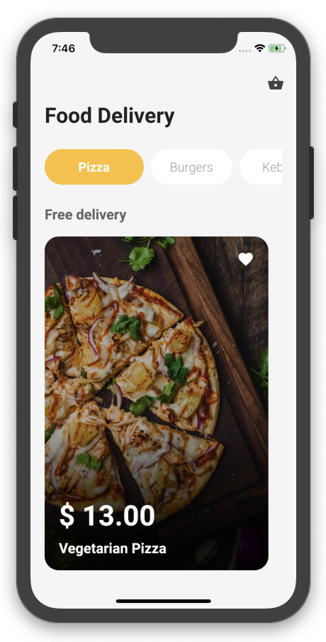

# food_delivery

A new Food Delivery App Flutter project.

design view Code by afgprogrammer.

## Getting Started

This project is a starting point for a Flutter application. I Just implement that include in afgprogrammer video on his youtube channel for my practice.

Big Thank's to afgprogrammer who make a video that i use for my practice.

## Development Setup

Clone the repository and run the following commands:
```
flutter pub get
flutter run
```

## Screenshot

Here is some UI View.

          
